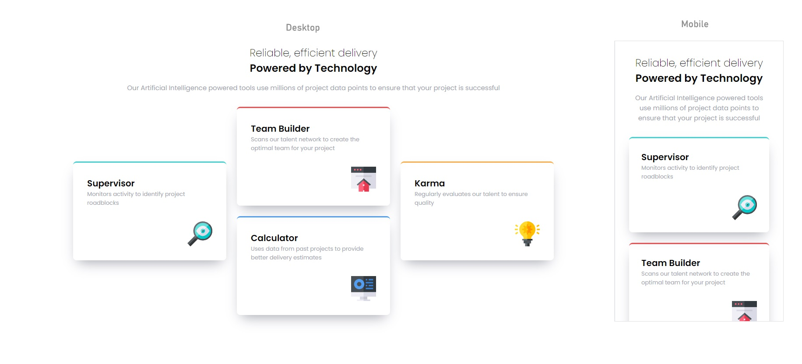

## Table of contents

- [Overview](#overview)
  - [Screenshot](#screenshot)
  - [Links](#links)
- [My process](#my-process)
  - [Built with](#built-with)
  - [What I learned](#what-i-learned)
  - [Useful resources](#useful-resources)
- [Author](#author)

## Overview

A four card feature landing page implementing reponsive design and CSS grid to adapt to the user's screen size.

### Screenshot

### Links

- Solution URL: [Github](https://github.com/i-prkr/four-card-feature)
- Live Site URL: [Github Pages](https://i-prkr.github.io/four-card-feature/)

## My process

### Built with

- Semantic HTML5 markup
- CSS custom properties
- Flexbox
- CSS Grid
- Mobile-first workflow
- Custom utility classes

### What I learned

Becoming more comfortable working with CSS grid and media queries, particularly modifying the grid in specific ways for effective content placement. Using more varied HTML elements such as hgroup.

### Useful resources

- [MDN CSS Grid](https://developer.mozilla.org/en-US/docs/Web/CSS/grid)

## Author

- Frontend Mentor - [@i-prkr](https://www.frontendmentor.io/profile/i-prkr)
- Github - [Github](https://github.com/i-prkr)
